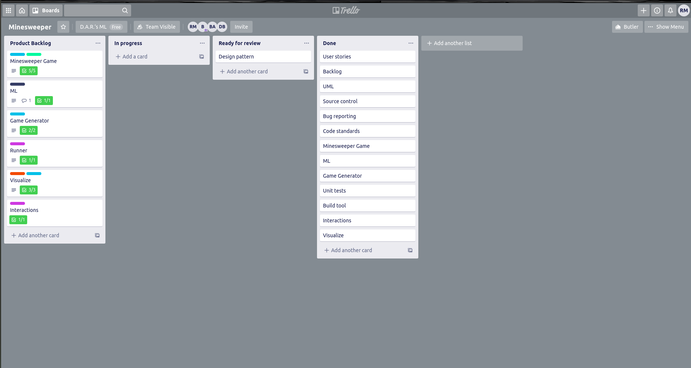

# Proiect Minesweeper MDS

## Contribuitori : 
  + [Anca-Maria-Brancoveanu](https://github.com/bancamaria)
  + [Ana-Ruxandra-Matei](https://github.com/ruxandramatei)
  + [Denisa-Boriceanu](https://github.com/n0nia)

## Linkuri:
  + [UML (deschideti cu diagrams.net)](https://drive.google.com/file/d/1tz78jsfjRAXVEUx7ICe6omLNRm29Fsr5/view?usp=sharing)
  + [Trello - team visible](https://trello.com/b/DFLoWyPV/minesweeper)
  + 
  + [Demo - cod](./demo.mp4)
## Structura

### CLASS MLFILE:

**Class ML** este clasa de baza, abstracta si utilizata pentru a verifica metode in particular; de asemenea, “leaga” toate clasele intre ele; aceste clase sunt:
 
+ reset-pentru a incepe un nou joc, are ca argument config din clasa GameConfig pentru a obtine configuratia jocului
+ next–pentru a face urmatoarea miscare, returneaza un tuplu i, j 
+ update-pentru a primi raspunsul unei mutari, are ca argument result din clasa MoveResult si obtine informatia despre urmatoarea mutare
+ flags-pentru a afisa lista cu pozitiile minelor ghicite, returneaza o lista de tupluri i, j

**Class gameGenerator(ML)** este clasa care genereaza structura jocului cu placile, steagurile, minele si numerele. Contine:

+ un constructor de initializare
+ o functie de resetare a tablei de joc in functie de mutarile care au avut loc pana in acel moment
+ o functie next pentru generare de tupluri aleatoare
+ o functie update care actualizeaza pozitiile dalelor selectate

**CLASS RUNNER FILE***:

**Class Runner** o folosim pentru a rula jocul. Ea contine 3 functii: constructorul, iteratorul si functia next care permite mutarile sau afiseaza game over.

**CONFIGURATION FILE**:

**Class Configuation** contine configuratia jocului, un constructor care defineste inaltimea si latimea tabelei de joc si numarul minelor din joc.

**MINESWEEPER GAME CLASS**:

**Clasa MinesweeperGame** 

Reuneste 14 functii cu diferite functionalitati:

+ constructrul, care are ca parametrii game_design(configuratia) si un parametru ooptional, o lista cu tuplurile pozitiilor minelor
+ _place_mines_random plaseaza aleator minele in table de joc
+ _init_neighbouring_counts calculeaza cate patrate vecine au minele, pentru toti vecinii
+ _is_inside_the_board verifica daca mutarea se afla sau nu in interiorul tablei de joc
+ select_square selecteaza urmatorul patratel apasat si returneaza rezultatul ca starea configuratiei curente si numarul de patratele selectate
+ _update_board afiseaza ce se afla sub o casuta selectata si returneaza lista patratelelor care au fost expuse
+ _expose_square numara cate casute au fost expuse in total
+ _test_if_neighbour_count_is_0 verifica daca numarul de mine din pozitia selectata este 0
+ quit_game afiseaza mesajul de iesire din joc
+ board_state returneaza starea tablei curente
+ game_result returneaza vicorie sau mesajul “the game is still going”, in functie de valoarea lui game_status
+ game_over paraseste jocul, afiseaza minele explodate sau mentioneaza daca numarul de casute ramase este egal cu numarul casutelor “sigure” astfel incat sa nu se apese pe o mina
+ game_status returneaza statusul jocului: playing, quit, defeat, victory
+ flags este folosita pentru momentele cand se doreste marcarea unei casute ca fiind “periculoasa”

In plus, mai avem o functie run_set_of_games care returneaza o lista de obiecte si are ca argumente configuratia cu parametrii jocului, numarul de jocuri, ML-ul si interfacta grafica

**MINESWEEPER RESULT CLASS**:

**Clasa MinesweeperResult** are ca atribute rezultatul jocului (win sau lost) si numarul de miscari ale unui joc si contine doar constructorul de initializare al acestor attribute

**RESULT FILE**:

**Clasa Result** are ca atribute multimea de patratele expuse dupa apasarea lor si statusul jocului; contine doar constructorul de initializare al acestor attribute

**SQUARE FILE**:

**Clasa Square** contine informatii despre o patratica(pozitia ei) si numarul de mine din vecinatatea ei. Clasa reuneste 3 functii: contructorul de initializare, functia de egailitate pentru mine su functia de hash pentru distributia minelor

**START_GAME FILE**:

Aici este se afla punctul de start si apelarile de unde dam run pentru a porni jocul. Acets fisier se comporta precum un main

**STATUS FILE**:
Clasa Status contine initializarile statusului jocului

**VISUALIZE FILE**:

Reprezinta fisierul cu cele 2 clase care ajuta la vizualizarea jocului (GUI)

**Clasa Visualizer** este clasa de baza si contine metoda abstracta run, cu iteratorul runner

**Clasa PyGameVisualizer** ajuta la reprezentarea vizuala. Contine un constructor de initializare cu parametrii ce reprezinta “pauza” dintre miscari si parametrul care ajuta la inchiderea jocului (din GUI). Se verfica adca evenimentul ce are loc este o miscare sau parasire a jocului

In functia _load_tiles se iau imaginile din folder si se aduc in program pentru realizarea GUI-ului, iar in functia _draw se afiseaza imaginea corespunzatoare fiecarui tip de casuta (casuta goala, casuta apasata, cifra, steagulet, mina)
